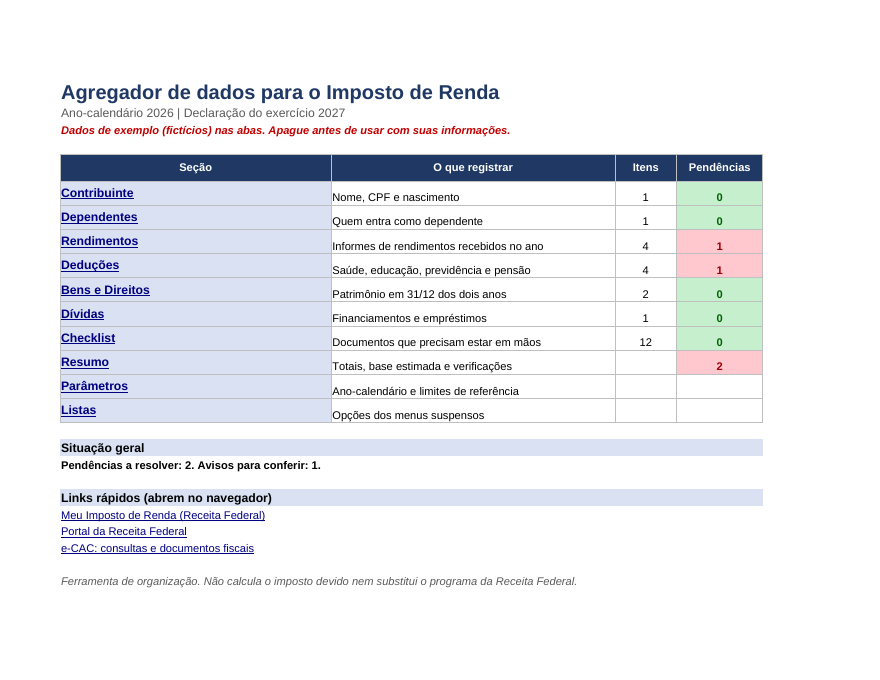
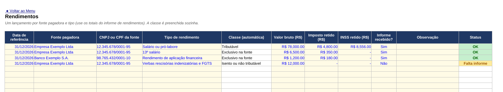
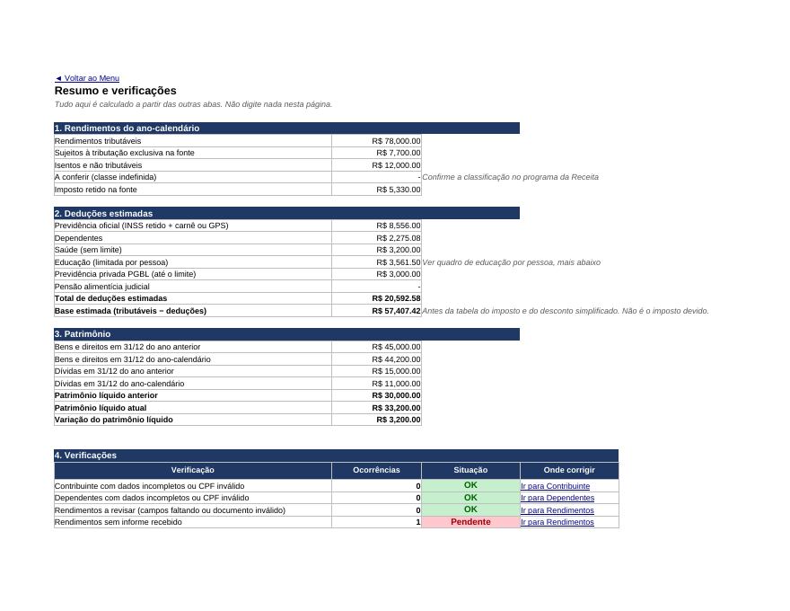

# agregador-imposto-de-renda-excel
Agregador de dados para a declaração de Imposto de Renda feito em Excel: menu de navegação, validações automáticas (CPF, datas, valores, listas), resumo de rendimentos, deduções e patrimônio, e verificação de pendências. Projeto do laboratório de Excel da DIO.
[README_IR.md](https://github.com/user-attachments/files/33016102/README_IR.md)
# Agregador de dados para o Imposto de Renda no Excel

Planilha que reúne em um só lugar as informações que a declaração de Imposto de Renda pede: dados pessoais, dependentes, rendimentos, deduções, bens, dívidas e documentos. Cada entrada passa por validações, e uma aba de resumo mostra o que ainda está pendente. Projeto do laboratório de Excel da DIO.

Arquivo principal: [`Agregador_IR.xlsx`](Agregador_IR.xlsx)

## Objetivo

Chegar ao dia de declarar com tudo organizado, em vez de procurar informe e recibo no último fim de semana do prazo. A ferramenta faz três coisas:

1. Recebe os dados de forma padronizada, com menus suspensos e regras que barram erro de digitação.
2. Soma e classifica o que foi lançado (rendimentos por classe, deduções com seus limites, patrimônio).
3. Aponta pendências: documento sem comprovante, CPF inválido, informe que não chegou.

Ela não calcula o imposto devido e não substitui o programa da Receita Federal. É uma etapa anterior, de organização.

## Prints

Menu de navegação, com contagem de itens e pendências por seção:



Aba de rendimentos, com a classe preenchida automaticamente e o status de cada lançamento:



Resumo, com totais, deduções estimadas e verificações:



## Como a planilha está organizada

| Aba | Para que serve |
|---|---|
| Menu | Ponto de partida: botões para cada aba, contagem de itens e pendências, situação geral e links rápidos |
| Contribuinte | Nome, CPF, nascimento, ocupação e município |
| Dependentes | Até 10 dependentes, com conferência do CPF |
| Rendimentos | Um lançamento por fonte e tipo, com classe automática (tributável, exclusivo na fonte, isento) |
| Deduções | Saúde, educação, previdência e pensão, com beneficiário e comprovante |
| Bens e Direitos | Valor em 31/12 do ano anterior e do ano-calendário, com a variação |
| Dívidas | Saldo devedor nos mesmos dois momentos |
| Checklist | Documentos que precisam estar em mãos e o que já chegou |
| Resumo | Totais, deduções estimadas, patrimônio e as 11 verificações |
| Parâmetros | Ano-calendário e limites de referência |
| Listas | Opções dos menus suspensos |

## Navegação

1. O Menu tem um botão por aba, feito com hiperlink interno.
2. Toda aba tem no topo o link "Voltar ao Menu".
3. No Resumo, cada verificação tem um link "Ir para" a aba onde o problema se corrige.
4. O Menu traz três links externos: a página do Meu Imposto de Renda, o portal da Receita Federal e o e-CAC.

## Validações

| Onde | Regra | O que acontece |
|---|---|---|
| Contribuinte, Dependentes | CPF conferido pelos dígitos verificadores | Mostra "CPF válido" ou "CPF inválido" e entra nas pendências |
| Rendimentos, Deduções | CNPJ ou CPF com 11 ou 14 dígitos (o CPF também passa pelos dígitos verificadores) | Status "Revisar" |
| Rendimentos | Imposto retido maior que o valor bruto | Status "Revisar" |
| Rendimentos | Informe de rendimentos não recebido | Status "Falta informe" |
| Deduções | Comprovante não guardado | Status "Falta comprovante" |
| Deduções | Educação acima do limite por pessoa | Status "Acima do limite" (aviso) |
| Datas | Precisam estar dentro do ano-calendário definido em Parâmetros | Bloqueia a digitação |
| Valores | Números maiores ou iguais a zero | Bloqueia a digitação |
| Tipo, beneficiário, parentesco, grupo de bens, Sim/Não | Só aceita itens da lista | Bloqueia a digitação |
| Beneficiário da dedução | A lista vem do titular e dos dependentes cadastrados | Quem não está cadastrado não aparece |

### Como o CPF é conferido

O CPF é lido sem pontos e traços. A fórmula multiplica os 9 primeiros dígitos pelos pesos de 10 a 2, calcula o resto da divisão por 11 e compara com o décimo dígito. Repete o processo com 10 dígitos e pesos de 11 a 2 para o último. Também recusa sequências repetidas, como 111.111.111-11. Tudo isso fica numa fórmula só, com `SUMPRODUCT`, `MID` e `MOD`, sem macro.

## Parâmetros

| Parâmetro | Valor usado | Observação |
|---|---|---|
| Limite de dedução com instrução, por pessoa | R$ 3.561,50 | Valor de referência dos últimos anos |
| Dedução por dependente | R$ 2.275,08 por ano | Valor de referência dos últimos anos |
| Limite do PGBL | 12% dos rendimentos tributáveis | Regra geral de dedução |

Vi esses valores em reportagens publicadas até 2026, não na fonte oficial. Antes de declarar, confirme no site da Receita Federal. Se mudarem, basta alterar a aba Parâmetros: as fórmulas acompanham.

## Como usar

1. Abra o `Agregador_IR.xlsx` e vá para a aba Parâmetros para conferir o ano-calendário.
2. Apague os dados de exemplo (fictícios) nas abas Contribuinte, Dependentes, Rendimentos, Deduções, Bens e Direitos, Dívidas e Checklist. Os CPFs e CNPJs de exemplo são inventados.
3. Preencha as células de fundo claro. As colunas de classe e status são automáticas.
4. Volte ao Menu e veja as pendências por seção.
5. Quando a situação geral estiver sem pendências, confira os avisos do Resumo e passe os dados para o programa da Receita.

## Limitações

1. A ferramenta não calcula o imposto devido, não aplica a tabela do IRPF nem compara declaração simplificada e completa.
2. A classificação dos rendimentos é orientativa. Tipos como lucros e dividendos e seguro-desemprego aparecem como "Conferir" porque a regra precisa ser confirmada no programa da Receita. Em verbas rescisórias, saldo de salário e 13º proporcional entram como salário e 13º, não como indenização.
3. As regras mudam de um ano para outro, inclusive a faixa de isenção. Este arquivo trata apenas de organização e conferência.
4. Capacidade fixa: 100 rendimentos, 150 deduções, 60 bens, 30 dívidas e 10 dependentes.
5. Os grupos de bens seguem a lista que conheço; confira os códigos no programa da Receita ao lançar.
6. Não importa dados da Receita nem de bancos. Tudo é digitado ou colado.

## Aprendizados

(Reescreva com suas palavras. Um ponto de partida:)

O que mais pesou foi decidir o que bloqueia e o que apenas avisa. Data fora do ano e valor negativo são erro sem discussão, então a planilha barra. Já educação acima do limite não é erro, porque o programa da Receita limita sozinho, então virou aviso. Aprendi também que um menu de navegação bem feito reduz o esforço de quem usa mais do que qualquer fórmula, e que concentrar as verificações numa aba só facilita achar o que falta. Na próxima versão, incluiria o cálculo comparando declaração simplificada e completa.

## Estrutura do repositório

```
.
├── README.md
├── Agregador_IR.xlsx
├── ir-01-menu.png
├── ir-02-rendimentos.png
└── ir-03-resumo.png
```

Aviso: projeto educacional. Não é orientação tributária.
